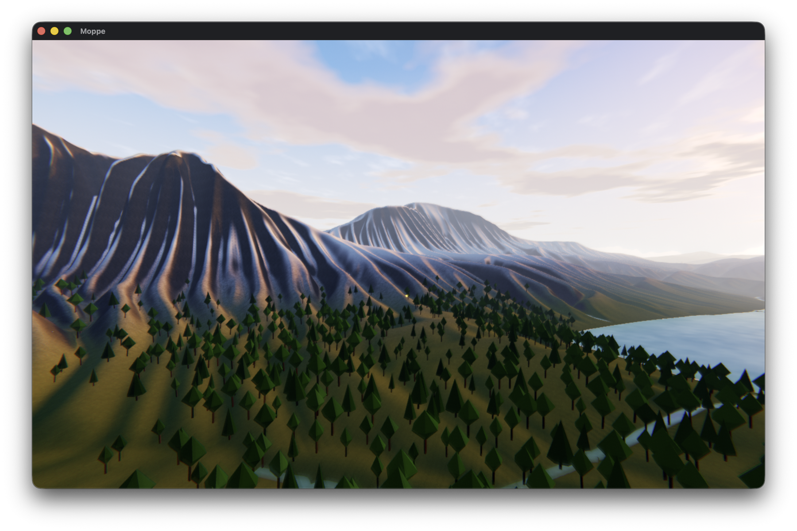
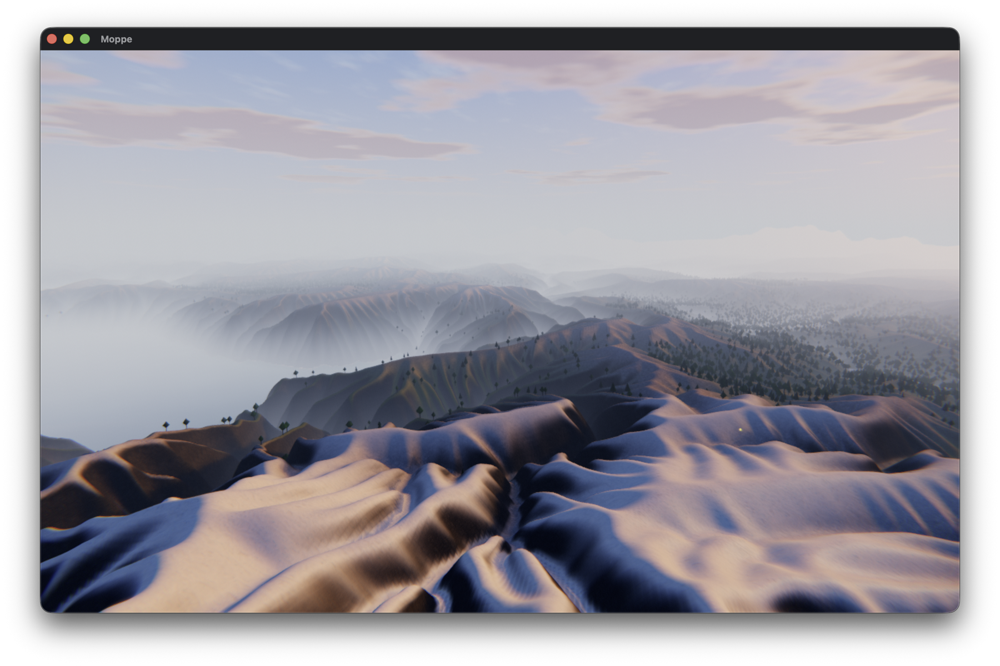
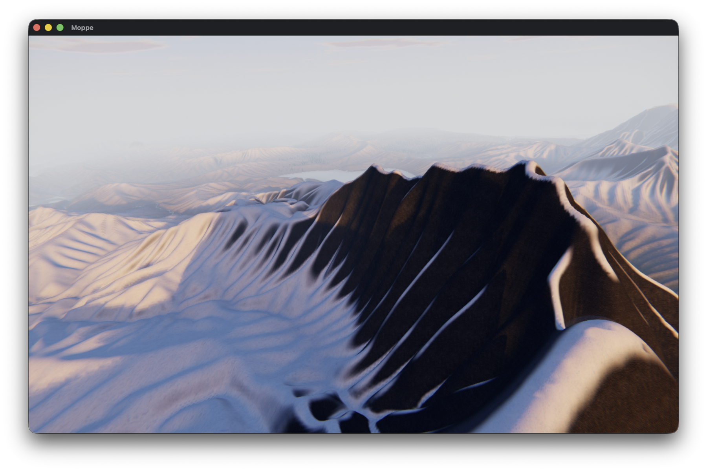
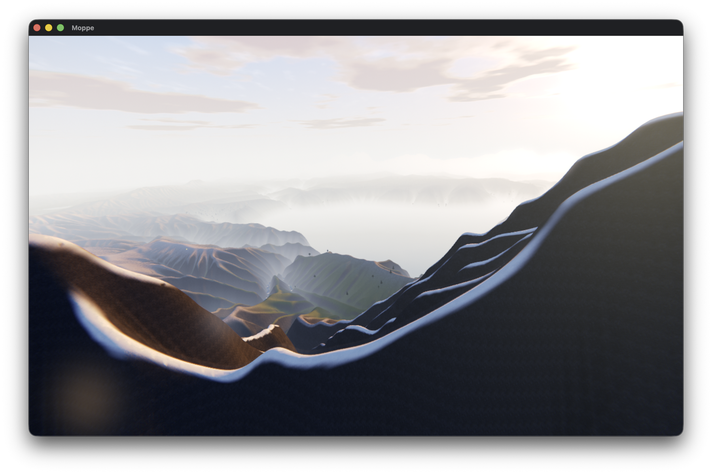
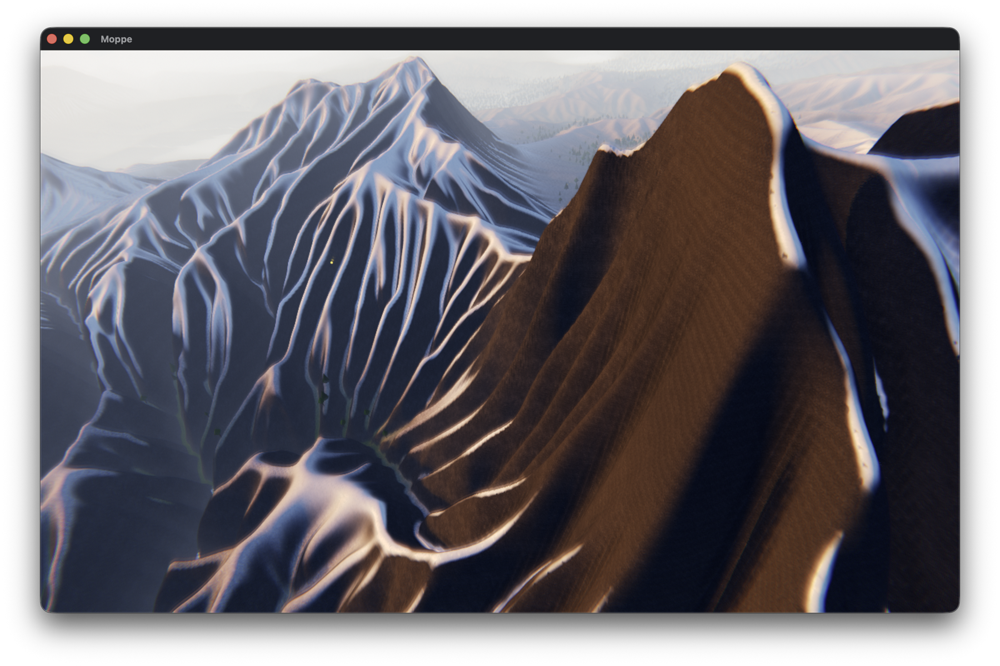
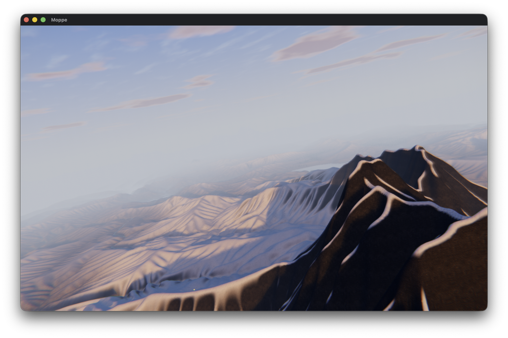

# Moppe

**A motorcycle game and a laboratory for generated worlds.**



Moppe grows landscapes from geological recipes, lets water find its routes,
settles forests into the resulting habitats, and puts a motorcycle into the
world. The aim is to make places with a readable history: mountains, rivers,
lakes, and trails that arise from the land instead of being scattered on top
of it.

Moppe is an active experimental project, not a packaged release. The current
game and its Terrain Lab run on a custom Metal renderer across macOS, iOS, and
tvOS.

## Generated landscapes

<p align="center">
  
  
</p>
<p align="center">
  
  
</p>
<p align="center">
  
</p>

Every world begins with a seed and a `TerrainProgram`: a geological source
followed by an explicit sequence of transformations. The same terrain model
feeds the game, Terrain Lab, tests, and command-line tools.

The current engine includes:

- procedural orogeny, erosion, drainage, lakes, rivers, and designed trails;
- deterministic seeded worlds with periodic topology;
- terrain-aware vegetation and generated-world spawn selection;
- motorcycle physics, a deployable hang glider, atmosphere, water, shadows,
  and post-processing;
- keyboard, touch, and game-controller input;
- Terrain Lab, an interactive instrument panel for editing and inspecting the
  world-generation pipeline; and
- a portable game-shaped rendering API with Metal backends for Apple devices.

## Build and run

The normal desktop workflow requires macOS, Xcode's developer tools, CMake
3.24 or newer, and Ninja. Configure and build with:

```sh
cmake -B build -G Ninja
cmake --build build
```

Run the game:

```sh
./build/moppe.app/Contents/MacOS/moppe
```

Useful ways to start it include:

```sh
# Revisit a particular generated world.
./build/moppe.app/Contents/MacOS/moppe --windowed --seed 123

# Open the world-generation workbench.
./build/moppe.app/Contents/MacOS/moppe --terrain-lab

# Select a supported graphics preset.
./build/moppe.app/Contents/MacOS/moppe --graphics-quality balanced
```

Run the test suite with:

```sh
ctest --test-dir build --output-on-failure
```

The first configuration fetches pinned source dependencies. CMake also emits
`compile_commands.json` automatically for editor tooling.

## Find your way around

- [Project status](docs/project.org) describes what exists, what is active,
  and what remains experimental.
- [Engine atlas](docs/engine-atlas.md) is the current map of the engine's
  domains, ownership boundaries, and target graph.
- [Generated worlds](docs/generated-world.md) explains construction and
  activation of a completed world.
- [Terrain expressions](docs/terrain-expressions.md) describes the runtime
  field language, recipes, and evaluator backends.
- [Planning](planning/README.md) contains accepted RFCs and dependency-shaped
  work items.
- [Ideas](ideas/README.md) holds the longer-range design writing behind the
  world.
- [Development guidelines](AGENTS.md) collects the complete build, capture,
  profiling, iOS, and working-practice commands.

The shortest description of the direction is: generate a landscape,
understand how it formed, render it convincingly, and ride through it. The
larger question is what becomes possible once the ride has taken you somewhere
worth noticing.
