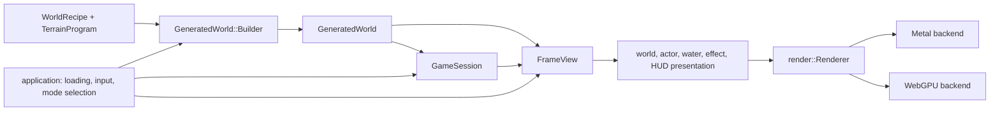
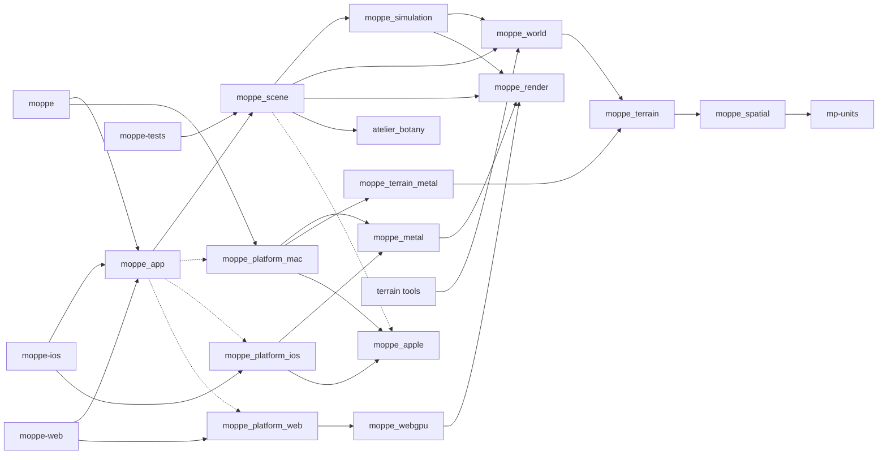

# Moppe engine atlas

This is the reader's map of the current engine after RFC-0001. It names the
values that make up a world, the mutable state that rides it, the immutable
reading that presents a frame, and the CMake targets that carry those
boundaries. Read it before the detailed subsystem documents; the
`current-engine-refactoring` track is retained as the history of how this
shape was reached, not as the architecture reference.

## One world, one frame

The main flow is data and borrows, not a generic scene graph or an ownership
diagram for CMake:

`GeneratedWorld` is the stable owner of one completed landscape.
`GameSession` is the mutable life played on that landscape. `FrameView` is a
new immutable reading composed for each visible frame; it does not own a
renderer, a platform object, or mutable actor state. The application selects
input and mode, advances the session, composes the view, and invokes the
concrete presenters in game-shaped order.

## Domains and ownership

| Domain | Owns | Does not own | Main locations |
| --- | --- | --- | --- |
| Quantity and finite-section vocabulary | `spatial::Bundle`, typed domains, and mp-units-facing section types | A terrain map, a world, or a rendering policy | `moppe/spatial/`, `moppe/quantities.hh` |
| Terrain programs | Field DAGs, terrain sources, transforms, recipes, and portable evaluators | A completed map, scene, platform, or renderer | `moppe/terrain/` |
| Completed world | Heightmap, surface, materialized analyses, water surface, and trails | Mutable player state, GPU resources, or an event loop | `moppe/map/`, `moppe/game/generated_world.*` |
| Simulation | Mutable rider, vehicle, glider, walker, camera, stars, dust, and checkpoint state | Loading, `GeneratedWorld` ownership, and platform effects | `moppe/mov/`, `moppe/game/game_session.*` |
| Frame and scene presentation | Immutable frame readings and focused terrain, water, actor, effect, and HUD presenters | Simulation mutation or an OS event loop | `moppe/game/frame_view.*`, game presentation files |
| Application and platform | Loading/activation, input adaptation, mode selection, host services, and terminal `main` | Portable terrain and simulation laws | `moppe/game/game.cc`, `moppe/game/terrain.*`, `moppe/game/terrain_lab.*`, `moppe/platform/` |
| Renderer and backend | Game-shaped draw/resource API, Metal resources, passes, command submission, and capture/timing lifecycle | Terrain policy, session state, or a generic render graph | `moppe/render/`, `moppe/render/metal/`, `moppe/shaders/metal/` |

`moppe/game/` is intentionally not one architectural layer. Its source files
belong to world construction, simulation, scene presentation, or application
composition according to what they own. The CMake targets below make that
division executable.

## World and intrinsic readings

`terrain::WorldRecipe` binds a terrain program to physical world parameters
and water datum. `GeneratedWorld::Builder` is the short-lived mutable
capability that evaluates the map, rebuilds `map::Surface`, analyzes hydrology,
and materializes derived readings. Once active, ordinary gameplay receives
const views of the completed world.

`map::SurfaceDomain` is the one finite lattice for the ground. It owns the
topology, site correspondence, spacing, and reconstruction stencil. Its
`SurfaceAtlas` groups typed 0-cochains by the named materialization boundary:

| Group | Typed sections | Valid when |
| --- | --- | --- |
| Geometry | `surface_elevation`, `surface_normal`, `snow_support` | `Surface::refresh()` |
| Hydrology | `channel_flux`, `surface_moisture`, `waterline_distance` | World hydrology/materialization |
| Geology | `erosion_exposure`, `deposition_cover` | Geological materialization |
| Ecology | `tree_habitat`, `forest_cover` | Ecological materialization |
| Use | `trail_influence`, `home_base_influence` | Trail and home-base materialization |

Geometry is always present after refresh. Later groups are individually
optional: absence means the corresponding world-building barrier has not run,
while a present all-zero section is a real reading. `map::WaterSurface` uses
the same domain but a distinct water bundle: `surface_elevation`,
`wave_amplitude`, and `water_velocity`. It is not a ground-atlas group merely
because both surfaces have matching texture dimensions.

`GeneratedWorld::Hydrology` is similarly a complete analytical value rather
than a collection of app-level optionals. It contains standing water, lake
census, drainage, fractional channels, waterways, and the river network.
`WaterSurface` and `TrailNetwork` remain optional completed-world artifacts:
a Terrain Lab preview may intentionally omit hydrology, and a terrain program
may omit trail formation. The detailed vocabulary, validity rules, and
quantity-to-texture mappings live in [Surface atlas](surface-atlas.md).

## State, lifetime, and handoff

| Value or phase | Owner and rule | Deliberately outside it |
| --- | --- | --- |
| `WorldRecipe` and `WorldParams` | Immutable construction description for a world | Live player progress and renderer history |
| `GeneratedWorld` | Non-copyable, non-movable owner of completed terrain and analyses | Platform, session, and GPU ownership |
| Loading candidate | Worker builds a fresh world; the loading preview sees copied height snapshots only | Mutation of the active world/session |
| Activation | Main thread transfers the completed owner once, retires the old session before its old world, then creates a fresh session | A half-built visible world |
| `GameSession` | Mutable run against one completed world's terrain and surface borrows | A replacement world or loading lifecycle |
| `GameState` | Copyable snapshot of mutable session systems, portable only between sessions on the same world | Terrain, water, renderer history, window state, and asynchronous loading |
| `FrameView` | Immutable per-frame snapshot of selected camera, lighting, graphics, poses, HUD, overlays, and visibility | Renderer/platform types and later simulation mutation |
| Terrain Lab transaction | Named mutable terrain borrow that restores the game's map on exit | An implicit permanent edit to the active world |

The ordinary playable step is
`advance_game_session(context, session, input, seconds_t)`. Its context lends
only the world-side readings simulation needs. Platform-side speech and other
application effects return as a small result for the application to realize.
The full checkpoint and replay boundary is described in
[Game state and replay](game-state.md); completed-world construction and
handoff are described in [Generated worlds](generated-world.md).

## Presentation and renderer boundaries

Presentation turns completed-world and frame readings into the renderer's
game-shaped API without pushing numeric packing or platform work down into the
terrain/simulation layers.

| Input | Presentation owner | Renderer-facing result |
| --- | --- | --- |
| Typed ground atlas and trails | `game::SurfacePresentation` | Terrain material/path texture lanes |
| Typed water bundle plus water datum/extent | `game::WaterPresentation` | Numeric ocean setup and water texture lanes |
| Completed-world river network | `game::RiverSurface` | Curved river ribbon mesh/data |
| `FrameView`, world, and session readings | Focused world, actor, water, effect, and HUD routines | Retained resources and `DrawList` commands in fixed frame order |
| Renderer calls | `render::Renderer` | Backend-independent resource/pass requests |
| Metal renderer state | `MetalTerrainResources`, `MetalWaterResources`, `MetalFrameTargets`, `MetalFrameEncoding` | Retained world resources, target resources, and one drawable submission |

Terrain, Water, and Scene operations share one lazy scene encoder; their
separate names do not imply a generic render graph or separate depth histories.
The Metal facade owns drawable acquisition, command-buffer lifetime, capture,
timing, and benchmark completion. See [Renderer and platform architecture]
(renderer-design.md) for resource and pass detail.

## Target graph

The source ownership above is reflected by these CMake targets. Arrows point
from a consumer to the target it consumes. Dashed Apple edges exist only in
Apple configurations; exactly one selected-platform edge is present per build.

`moppe_spatial` is deliberately header-only: its types expose mp-units
vocabulary but need no translation unit. `moppe_terrain` keeps reusable field
and hydrology algorithms free of world, scene, and platform code.
`moppe_world` adds concrete map storage, materialization, `GeneratedWorld`,
the renderer-free Terrain Lab model, and deterministic water-capture selection.

`moppe_simulation` has a real dependency on `moppe_render`: session-owned
Stars retain meshes and Stars/Dust expose their presentation operations. This
is an explicit current constraint, not a claim that physics needs Metal.
`moppe_scene` composes the completed-world and session readings, with
Apple-common asset/glyph support where available, but has no OS event loop or
renderer backend. `moppe_app` holds the two host-service callers (`Terrain`
and `TerrainLab`); terminal programs retain `game.cc` because it defines
`main` and chooses the macOS, iOS, or browser host.

The ordinary desktop game consumes the app/scene path; portable tests begin at
the testable scene target and do not link a desktop event loop. Terrain
command-line tools consume only `moppe_world`, so they do not pull in the
desktop platform merely because unrelated presentation code was compiled into
a broad archive.

## Current scope and deliberate gaps

This atlas describes the completed RFC-0001 slice. It does not claim that the
Atelier proposals have replaced Moppe, that every run is bitwise reproducible,
or that every renderer backend has visual feature parity.

- The duplicated periodic heightmap seam and implicit elevation/chart origins
  remain current-engine facts; a seam-free topology and registered frame
  projections remain Atelier-earth work.
- `GameState` makes fixed-world session replay practical, but world generation,
  renderer history, window state, and loading are not checkpoint state.
- Metal is the full-fidelity native backend. WebGPU is the supported playable
  browser backend, with a deliberately lower-cost default presentation;
  Android remains unimplemented.
- Persistent places, routes, and player traces belong to later world work, not
  to the completed-world/session boundary described here.

## Detailed maps

- [Surface atlas](surface-atlas.md) — domains, all typed sections, validity,
  and presentation lanes.
- [Terrain expressions](terrain-expressions.md) — field/program/recipe and
  evaluator design.
- [Generated worlds](generated-world.md) — construction capability and
  activation lifetime.
- [Game state and replay](game-state.md) — session checkpoint and benchmark
  boundary.
- [Refactoring seams](refactoring-seams.md) — preserved characterization and
  runtime smoke contracts.
- [Renderer and platform architecture](renderer-design.md) — Metal resources,
  frame encoding, and host implementation detail.
