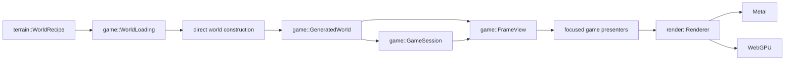
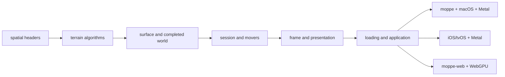

# Moppe engine atlas

This is the map of the current engine after the direct-generation and lattice
harmonization work. Read it before the detailed subsystem documents. The
completed RFC-0001 track explains how the ownership shape was reached; the
active RFC-0002 track closes the remaining migrations and begins the
water-body relation work.

## One world, one frame


```mermaid
flowchart LR
  recipe["terrain::WorldRecipe"] --> loading["game::WorldLoading"]
  loading --> build["direct world construction"]
  build --> world["game::GeneratedWorld"]
  world --> session["game::GameSession"]
  world --> view["game::FrameView"]
  session --> view
  view --> scene["focused game presenters"]
  scene --> renderer["render::Renderer"]
  renderer --> metal["Metal"]
  renderer --> webgpu["WebGPU"]
```

`WorldLoading` owns one background build and publishes one completed owner.
`GeneratedWorld` is the immutable, renderer-free landscape assembled from
finished parts. `GameSession` is the mutable life played on that landscape.
`FrameView` is a fresh immutable reading composed for each visible frame. The
application keeps the order explicit: select input and mode, advance the
session, compose the view, then present world, actors, water, effects, and
overlays.

There is no scene graph, engine manager, or CMake ownership hierarchy behind
this flow.

## Domains and storage

`terrain::TerrainDomain` is the one finite lattice for ground, water, and
cell-valued analyses. It owns width, height, periodic topology, physical
spacing, site indexing, and continuous reconstruction. A 2048-sample torus
stores 2048 by 2048 values; wrapping belongs to domain sampling rather than a
duplicated seam row or column.

`spatial::Bundle<Domain, Quantities...>` is eager typed structure-of-arrays
storage over a finite domain. Columns are selected by quantity specification,
not by a positional float-lane convention. Narrow analysis bundles compose
into wider stores with `spatial::join`; persistence uses Arrow IPC with domain,
quantity, unit, dimension, and representation metadata.

The current surface values are:

| Value | Owner | Typed contents |
| --- | --- | --- |
| `map::SurfaceGeometry` | `GeneratedWorld` | elevation, normal, eroded and deposited material, snow support |
| `map::SurfaceReadings` | `GeneratedWorld` | channel flux, moisture, waterline distance, geology/ecology signals, trail and home-base influence |
| `terrain::WaterSheets` | `GeneratedWorld` | water elevation, wave amplitude, planar velocity |

`SurfaceGeometry` is the ground surface; no `map::Surface` wrapper remains.
Ground and water share `TerrainDomain` and the same affine elevation
specification, so subtracting their elevation points yields physical depth.
They remain separate bundles because they are separate things.

## Direct world construction

`WorldRecipe` binds physical extent, resolution, water datum, seed, generation
profile, stream-power evolution, and trail formation. `WorldLoading` spells
the one real construction order literally:

```text
SurfaceGeometry(TerrainDomain)
  -> initialize_terrain
  -> evolve_terrain
  -> form_terrain_trails
  -> rebuild_geometry
  -> analyze_hydrology
  -> analyze_surface
  -> GeneratedWorld
```

The expensive geometry bundle may come from a typed Arrow cache. Whether
loaded or generated, normals and broad snow support are rebuilt before water
analysis. Hydrology derives, in order, a `FloodField`, `LakeCensus`,
`DrainageGraph`, `FractionalDrainage`, and `RiverNetwork`. Surface analysis
then paints `WaterSheets` and joins the completed ground readings. The census
owns a finite `WaterBodyDomain`, checked cell membership, and physical body
rows; consumers that only need identity borrow the membership relation.

There is no terrain expression DAG, generic evaluator, transform variant,
program editor, checkpoint ledger, or second mutable Terrain Lab execution
path.

## Completed-world ownership and activation

`GeneratedWorld` owns:

- bound `WorldParams` and its `WorldRecipe`;
- `SurfaceGeometry`;
- the complete hydrology result;
- `WaterSheets`;
- `TrailNetwork`; and
- `SurfaceReadings`.

Holding a `GeneratedWorld` therefore means construction is complete.
`WorldLoading` is single-flight and non-cancellable. The worker shares loader
state, never a raw application pointer, and reports only status text while it
works. The main thread polls and takes the completed `unique_ptr` exactly once.

During replacement, `MoppeGame` keeps the outgoing session and world alive,
activates the new owner, binds a new session to its geometry, then destroys the
old session before the old world. No terrain borrower survives its owner, and
the visible world is never a half-built candidate.

## Mutable session and replay

`GameSession` owns `GameLogicState`, two vehicles, the glider, walker, chase
camera, stars, and dust. It borrows the active world's geometry for physical
readings but does not own loading or a replacement world.

`advance_game_session(world, surface, obstacles, session, input, dt)` is the
ordinary fixed-step operation. Its small result reports application effects
that portable simulation cannot realize itself.

`GameState` is the copyable snapshot of mutable session systems. It is valid
for replay against the same completed world. Generated artifacts, renderer
history, loading state, platform state, and the window are outside it. The
graphics benchmark restores this snapshot, replays an input tape, resets
renderer temporal history, and measures matched logical frames under different
feature masks.

## Frame and presentation

`FrameView` freezes the camera, lighting, weather, graphics choices, mover
poses, HUD, benchmark coordinates, overlays, and visibility selected for one
frame. It owns no renderer or platform type and is not a second mutable scene.

`LandscapeGazetteer` is a pure completed-world reader that selects a balanced
set of documentary places. The application turns each typed eye, subject, and
field-of-view reading into `FrameSceneMode::Gazetteer`, freezes the session and
weather, lets renderer-owned resources settle, and asks the ordinary frame
presenters for one PNG. It does not drive a hidden demo or introduce a second
render path. See [Landscape gazetteers](landscape-gazetteer.md).

Presentation is deliberately game-shaped:

| Input | Presentation |
| --- | --- |
| geometry and ground readings | terrain setup and typed texture descriptions |
| water sheets and datum | ocean setup, water level/amplitude, and flow textures |
| river network | horizontal water painting plus vertical waterfall curtains |
| world and frame readings | terrain, forest, actors, water, effects, HUD |

Typed quantities become numeric texture or API storage only here. The renderer
owns resources and passes, not terrain policy.

## Renderer and platform

`render::Renderer` is a portable interface shaped around Moppe's resources and
draw order. Metal and WebGPU implement it directly; there is no generic render
graph or shader translation layer.

Metal is the full presentation. Its backend owns completed-world terrain and
water resources, resizeable frame targets, one frame's command-buffer
encoding, captures, timing, and temporal history. Terrain, water, and scene
share one lazy scene encoder before post-processing and HUD.

WebGPU is a playable browser backend with a deliberately lower-cost default
presentation. The browser host uses Emscripten, WebGPU, Canvas2D glyph
rasterization, and `requestAnimationFrame`. Apple hosts add their selected
platform event loop and the Metal backend to the same game/application source
groups.

## Build composition

CMake expresses ownership with named source groups but deliberately does not
turn them into internal libraries:


```mermaid
flowchart LR
  spatial["spatial headers"] --> terrain["terrain algorithms"]
  terrain --> world["surface and completed world"]
  world --> simulation["session and movers"]
  simulation --> scene["frame and presentation"]
  scene --> app["loading and application"]
  app --> desktop["moppe + macOS + Metal"]
  app --> mobile["iOS/tvOS + Metal"]
  app --> browser["moppe-web + WebGPU"]
```

Each terminal executable compiles the source groups it needs directly as one
unity translation unit per source language. This preserves conceptual
ownership without repeatedly parsing the mp-units-heavy header graph at
artificial library boundaries. Tests are excluded from the default CMake
build and must be requested through `make test` or the `moppe-tests` target.

The ordinary product target is Moppe. Atelier, Lavoir, and Étalon remain
explicit workshops rather than alternate engine layers.

## Completed consolidation and deliberate gaps

The [current status](status.md) and
[engine-consolidation track](../planning/tracks/engine-consolidation/README.md)
record the completed closure. Typed ground and water texture descriptions
share direct backend staging, the numerical-exit helper family is gone, and
Moppe is again the ordinary build.

Lake identity is the first relational world slice: a typed body domain,
checked membership, and physical measurement rows are current. Inlet, spill,
outlet, and downstream consumers ground the next relation-specific tables
described in [Lake identity and relations](lake-domain.md). Persistent places,
roads, settlements, complete process history, and a generic ontology runtime
are not current subsystems.

## Detailed maps

- [Current status](status.md)
- [Surface storage and presentation](surface-storage.md)
- [Terrain generation and analysis](terrain-expressions.md)
- [Lake identity and relations](lake-domain.md)
- [Generated worlds](generated-world.md)
- [Game state and replay](game-state.md)
- [Landscape gazetteers](landscape-gazetteer.md)
- [Refactoring seams](refactoring-seams.md)
- [Renderer and platform architecture](renderer-design.md)
