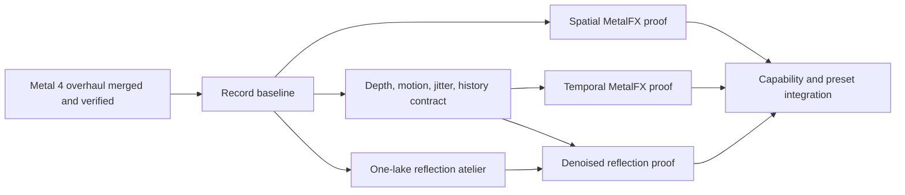

# RFC-0004: Reconstruct expensive pixels on Metal 4

Status: accepted

## Decision

After the current Metal 4 overhaul lands, Moppe will investigate rendering
fewer expensive samples and reconstructing them well before it adds more
full-resolution effects. The campaign has three increasingly demanding parts:

1. replace the final linear enlargement of a reduced-resolution scene with
   MetalFX spatial upscaling;
2. prove the depth, motion, jitter, exposure, and history contract required by
   MetalFX temporal upscaling; and
3. build one narrowly scoped hybrid ray-tracing atelier for water reflections,
   then use MetalFX denoising only if the traced signal and its auxiliary
   buffers justify it.

This is not a decision to turn Moppe into a path tracer, build a generic render
graph, or make machine learning a new engine layer. The fixed, game-shaped
renderer remains. Metal 4 command recording, resource ownership, explicit
synchronization, MetalFX, and ray tracing are mechanisms inside that concrete
backend.

The order matters. Spatial upscaling can improve the resolution trade already
proven by the `balanced` and `low` presets without changing scene shaders.
Temporal reconstruction asks the renderer to state previously implicit frame
history. Ray-traced reflections ask it to represent additional geometry and
produce a noisy signal. Neural denoising is useful only after all of those
inputs are correct.

The decision is accepted. Its first execution track is
[`pixel-reconstruction`](../tracks/pixel-reconstruction/README.md), which
freezes the post-overhaul baseline and proves spatial MetalFX before any
temporal or ray-tracing work begins.

## Why this, and why after the overhaul

Moppe is already a resolution-scaling renderer. The macOS scene resolution is
bounded independently of the drawable, `balanced` renders the scene at two
thirds of drawable resolution, and `low` renders at one half. The final present
shader enlarges the linear HDR scene while also applying exposure, bloom, lens
treatment, tone mapping, grading, and EDR output. The HUD is drawn afterwards
at native point resolution.

That arrangement bought more GPU headroom than removing any one optional
effect. It also made the compromise visible: ordinary linear filtering cannot
reconstruct detail that the lower-resolution scene did not sample. MetalFX is
therefore not an unrelated feature. It is a higher-quality realization of a
choice the renderer has already made.

The current Metal 4 overhaul is a hard prerequisite, not the first phase of
this RFC. It changes command encoding, bindings, residency, synchronization,
resource upload, timing, and platform handoff underneath every proposed pass.
Implementing MetalFX or acceleration structures concurrently would make it
impossible to distinguish an adoption error from a new feature error and would
force the overhaul agent to stabilize targets that this RFC immediately moves.

The takeover boundary is a merged, verified Metal 4 renderer. This RFC begins
only when all of the following are true:

- the Apple backend uses the Metal 4 command queue, reusable command buffer,
  per-flight command allocators, argument tables, residency set, shared-event
  pacing, and explicit barriers as its one production path;
- no legacy command-encoding compatibility path remains in the renderer;
- macOS gameplay, screenshots, deterministic captures, Metal capture, counter
  timing, and graphics benchmarks work through that path;
- iOS and tvOS simulator builds complete, with unsupported framework features
  reported rather than silently ignored;
- `MTL_DEBUG_LAYER=1` produces no validation errors in a representative live
  run; and
- the visual and performance baseline below has been recorded before new
  frame targets or pass ordering are introduced.

## Current optical and ownership starting point

The existing design has unusually good seams for this work:

- `MetalFrameTargets` owns size- and quality-dependent scene, depth, bloom,
  exposure, and feedback resources.
- `MetalFrameEncoding` owns one drawable frame and its command-buffer,
  allocator, argument-table, timing, capture, and completion state.
- terrain, water, scene, post, and HUD are named operations over those owners,
  not independent schedulers.
- `reset_temporal_state()` already names the renderer-history boundary used by
  benchmark replay, gazetteer camera changes, and other discontinuities.
- horizontal water is one `WaterSheets` field spanning ocean, lakes, and
  rivers, with per-point elevation, amplitude, and planar flow.
- the water shader already computes the viewing vector, perturbed optical
  normal, reflected direction, physical air-to-water Fresnel, GGX sun glint,
  Beer--Lambert bed transmission, in-scattering, foam, and a procedural sky
  environment.

Ray tracing does not replace that water model. It supplies a better value for
the reflected environment when a ray meets terrain or, later, selected scene
geometry. A miss continues to use the procedural sky. The existing Fresnel and
transmission terms still decide how much reflected radiance reaches the frame.

This is particularly suitable for Moppe's water. A conventional planar
reflection camera represents one plane, while the world contains sea, lakes,
and running channels at many elevations. A ray starts at the actual water
point and follows its actual normal, so one mechanism serves all of them.

## Capability ladder, not one feature switch

The Apple feature table and the SDK APIs describe different hardware floors.
The renderer must query support at runtime and resolve a truthful capability
set; an OS version or marketing device name is not a substitute.

| Capability | Effective use in Moppe | Fallback |
| --- | --- | --- |
| MetalFX spatial scaling | First experiment on supported macOS and iOS Metal 4 devices | Existing linear present sample |
| MetalFX temporal scaling | After sampleable depth, motion, jitter, and reset semantics are proven | Spatial scaling or existing present |
| Compute ray tracing | Reflection atelier; useful on the Metal 4 device floor but expected to vary greatly in cost | Existing procedural sky and bank proxy |
| Fixed-function ray traversal | Treat Apple-family 9 and later as the serious product tier | Keep reflection tracing experimental or disabled |
| MetalFX denoised upscaling | Apple-family 9 and later, after `supportsMetal4FX` succeeds | Do not ship a second home-grown denoiser under this RFC |
| Frame interpolation | Explicitly deferred | Native presentation cadence |
| Custom ML command encoder | Explicitly deferred | Existing analytical post chain |
| Shader TensorOps neural acceleration | Atelier-only possibility on its actual hardware tier | Existing analytical shaders |

The current MetalFX SDK surface is available on macOS and iOS, not tvOS.
WebGPU likewise retains its current presentation. These are stated platform
differences, not silent no-ops: startup diagnostics and resolved graphics
settings must say which path each backend actually selected.

## Proposed frame shape

The final shape is conditional: spatial and temporal scaling are alternatives,
and ray-traced water exists only on a supported high-end tier.

```text
completed-world resources
  terrain/water textures
  optional reflection-only terrain acceleration structure
          |
          v
jittered opaque scene raster at chosen input resolution
  color + sampleable depth + motion + reconstruction auxiliaries
          |
          +-------------------------------+
          |                               |
          | optional low-resolution       | no traced reflection
          | water-reflection inputs       |
          v                               |
  one-bounce reflection rays              |
  + reflected-hit properties              |
          |                               |
  optional MetalFX denoised scaling       |
          |                               |
          +------> water optical composite+
                          |
                  finish scene raster
                          |
              +-----------+-----------+
              |                       |
       temporal mode              spatial mode
       upscale before             post first, then
       post effects               scale at the chosen
              |                   HDR/perceptual boundary
              +-----------+-----------+
                          |
                 final color treatment
                          |
               native-resolution HUD and present
```

That diagram is a semantic sequence, not a request for a render-graph
framework. The implementation should remain a readable left-to-right frame in
`MetalRenderer` with a few named resource owners and pass operations.

## Execution sequence and gates



Each box is an evidence gate. Failure stops or narrows the branch; it does not
justify weakening the comparison.

### Gate 0: Freeze the post-overhaul baseline

Before adding a scaler, record the exact renderer and hardware state:

- resolved graphics settings and device feature support;
- drawable, scene, bloom, and depth dimensions and formats;
- frame GPU time plus the existing scene, water, post, bloom, exposure, and
  present timing buckets;
- target allocation sizes and acceleration-structure size once that branch
  begins; and
- deterministic captures for the opening cinematic, representative gazetteer
  views, and the `lake`, `mouth`, and `confluence` water views.

Measure `high`, `balanced`, and `low` on the same gameplay interval. Loading
frames do not count. Preserve the captures and CSV summaries outside the build
tree or in a deliberately checked-in findings document; do not commit binary
traces by accident.

Acceptance: a later result can be compared against the same logical frames,
camera path, scene scale, drawable size, and feature set.

### Gate 1: Spatial MetalFX is the smallest useful proof

Create one renderer-owned `MTL4Compiler` and reuse it when creating MetalFX
objects. Create an `MTL4FXSpatialScaler` only when target dimensions or formats
change, never per frame. Configure every input and output texture with the
usage bits the scaler reports. Encode it into the existing frame command
buffer and place an explicit writer-to-scaler and scaler-to-reader barrier
where the resource transition requires one.

The first integration should preserve Moppe's linear HDR/EDR path. Use the
scaler's HDR processing mode between the finished scene/post input and the
native-resolution final treatment. Keep bloom semantics and the HUD unchanged.
If Apple's preferred perceptual placement after tone mapping proves materially
better, split the present operation into a low-resolution scene-treatment pass,
the scaler, and a native-resolution display/HUD pass. Do not silently move the
color grade or clip EDR headroom merely to fit the scaler.

Compare four things separately:

1. current linear enlargement;
2. MetalFX at the same input size;
3. a lower MetalFX input size chosen to match current perceived quality; and
4. native rendering as the reference, not as the expected performance target.

Texture mip bias begins from Apple's scale-dependent recommendation and is
then judged on Moppe's high-frequency terrain, grass, water, and trail detail.
A sharper still that flickers in motion is a failure.

Acceptance:

- HUD and text remain pixel-accurate and never enter the scaler;
- EDR highlights, exposure, bloom, water edges, and the final grade remain in
  the intended color spaces;
- the cinematic and a ride show no unstable shimmer or obvious ringing;
- GPU timing names the scaler's cost; and
- either MetalFX produces a visible quality gain at `balanced`, or a lower
  input resolution matches today's `balanced` quality with useful net headroom.

If neither is true, retain the finding and stop. Spatial MetalFX does not land
merely because the framework call succeeds.

### Gate 2: Make temporal state explicit before temporal upscaling

Temporal MetalFX is not a replacement filter. It requires a coherent account
of where a visible sample came from and where it was in the previous frame.
Build and inspect that account before enabling the scaler.

Required renderer state:

- jittered and unjittered current and previous view-projection matrices;
- one sampleable, single-sample reversed-Z depth texture;
- motion vectors in the exact direction and units MetalFX expects;
- previous object transforms or positions for moving actors and deforming
  geometry where camera-only motion is insufficient;
- a reactive mask for particles, foam, spray, alpha-tested foliage, and other
  pixels whose motion is unreliable;
- the current exposure value in the form MetalFX expects; and
- one history epoch invalidated by resize, target recreation, world change,
  loading-to-game transition, camera cut, gazetteer shot, benchmark restore,
  and explicit `reset_temporal_state()`.

Motion vectors are dejittered. Debug views must show depth, motion magnitude
and direction, disocclusion, reactive pixels, jitter, and history resets.
Correct still frames are insufficient: the acceptance path includes camera
rotation, fast riding, glider motion, moving foliage, water, dust, and a hard
scene cut.

Temporal AA normally replaces scene MSAA. The default experiment uses a
single-sample scene color/depth path when temporal scaling is enabled and
compares it against current 2x/4x MSAA. Keeping both is allowed only if a
capture and timing result show a concrete benefit greater than their combined
bandwidth cost.

Encode temporal scaling before effects that manufacture screen-space history,
including the current ghost-style motion blur. Bloom, tone mapping, grading,
and HUD remain ordered according to their color-space and native-resolution
requirements. Dynamic resolution is a later control policy over a working
temporal scaler, not part of initial correctness.

Acceptance:

- static geometry converges rather than crawls;
- disoccluded terrain and shorelines recover without long ghosts;
- actors do not leave reflections or silhouettes behind;
- vegetation, spray, foam, and dust remain stable or are explicitly excluded
  through reactive/overlay inputs;
- reset events produce one clean new history rather than undefined contents;
  and
- the measured result improves the practical quality/performance frontier over
  both spatial MetalFX and the current MSAA presets.

### Gate 3: One-lake hybrid reflection atelier

The first ray-tracing work is a local proof, not a whole-scene conversion.
Use a deterministic lake viewpoint and its surrounding terrain as the forcing
case. The proof has one question: do actual terrain and bank silhouettes in
the reflection improve Moppe enough to justify the new representation and GPU
cost?

The raster terrain is vertex-pulled from a height texture and has no complete
world-space triangle buffer for an acceleration structure. Build a separate,
reflection-only triangle proxy from the authoritative completed surface. It is
a backend presentation resource, not a second terrain owner. Begin with a
bounded, decimated region around the chosen lake; report triangle count,
construction time, memory, and silhouette error. Do not build the full 2048 by
2048 lattice at native density merely because it is available.

The first acceleration structure contains opaque terrain triangles only. It
is built once for the completed world and retained with the corresponding
Metal world resources. It has no moving instances, custom intersection
functions, refits, recursive rays, shadows, global illumination, or exact tree
geometry. A miss samples the current procedural sky. A hit reconstructs world
position and reads a deliberately small terrain-radiance approximation from
the existing surface fields.

The production hypothesis is a low-resolution water-input pass followed by a
compute ray pass, not one ray hidden inside every MSAA water fragment. The
water input contains the world-space origin, optical normal, roughness,
Fresnel weight, depth, motion, and a validity mask. The compute pass traces at
most one closest-hit reflection ray per valid input pixel and writes reflected
radiance plus the hit properties needed by later reconstruction. The ordinary
water pass samples the result and retains ownership of transmission, body
color, glint, foam, spray, and fog.

The direct render-shader intersector remains a useful throwaway diagnostic for
a fixed capture if it proves the visual question faster. It is not the assumed
shipping path because it couples ray count to raster sample frequency and
hides the noisy signal from a dedicated reconstruction stage.

Acceptance:

- the lake reflects a recognizable terrain/bank silhouette that the current
  procedural environment cannot produce;
- a ray miss is visually identical to the existing sky reflection;
- reflection respects the existing water normal, Fresnel, roughness, fog, and
  depth-dependent transmission rather than replacing the water material;
- proxy construction does not stall first gameplay presentation unnoticed;
- captures include current, raw ray-traced, and composited results; and
- timing and memory evidence decide whether the branch proceeds.

If the visual gain is small, a better analytical bank environment or a
bounded planar reflection may be the honest answer. The acceleration structure
does not become permanent merely because it works.

### Gate 4: Denoise only the signal that earned it

MetalFX denoised upscaling is a separate hardware tier. Query
`[MTLFXTemporalDenoisedScalerDescriptor supportsMetal4FX:device]` and keep the
current water reflection everywhere it fails. The feature table places
denoised upscaling on Apple-family 9 and later; do not manufacture a second
denoiser for older devices under this RFC.

The denoiser receives clean, inspectable auxiliary inputs:

- noisy reflected radiance;
- reflected diffuse and specular albedo;
- reflected normal and roughness;
- optional specular hit distance;
- reversed-Z depth and correct dejittered motion;
- a strength mask for pixels that should remain analytical; and
- a transparency or reactive treatment for sky, foam, spray, and other
  signals without trustworthy geometry.

Water and glass have little diffuse color of their own. Follow Apple's primary
surface replacement guidance: the auxiliary properties at a reflective pixel
describe the reflected hit, while reflection and transmission properties are
combined according to the same Fresnel term used by the water composite. A
normal map describing only the primary water sheet is not an adequate guide
for denoising a reflected mountain.

Every auxiliary input gets a renderer debug view and appears in a GPU capture.
The denoiser is created or recreated at target-configuration boundaries and
encoded in the existing Metal 4 command buffer. Its resources are independently
owned per in-flight frame where cross-frame reuse would introduce a false
dependency. History reset follows the same epoch as temporal upscaling.

Acceptance:

- one sparse reflection sample becomes stable in both a still camera and a
  moving ride;
- terrain silhouettes stay sharp instead of smearing across the water;
- reflection and transmission do not leak into each other's auxiliaries;
- a raw-versus-denoised debug toggle makes failures attributable;
- the scaler cost, ray cost, acceleration-structure cost, and memory footprint
  are reported separately; and
- unsupported devices select the current water path explicitly.

### Gate 5: Productize only proven combinations

Experiments begin behind narrow developer controls. A successful mechanism
then becomes typed graphics configuration, not permanent environment-variable
folklore.

Keep reconstruction policy separate from the existing quality presets while
it is being measured:

```text
upscaling: native | spatial | temporal
water reflections: analytical | traced
reflection reconstruction: none | MetalFX denoised
```

The final preset resolver may choose combinations, but it must print the
requested and resolved modes, the reason for every fallback, input/output
dimensions, MSAA state, and the active hardware capability tier. Benchmarks
record the resolved modes in their CSV rather than only the user's request.

A temporal benchmark warms the history before measured frames, resets it
between configurations, and restores the same logical game state. A traced
reflection benchmark uses fixed water viewpoints as well as the matched
gameplay tape; a spawn-point average cannot judge a feature that may be absent
from the frame.

## Resource ownership and Metal 4 practice

This RFC extends the renderer's existing ownership rather than introducing a
general resource manager.

- Scalers, their compiler-created state, size-dependent auxiliary targets,
  output targets, and history validity belong to the frame-target
  configuration lifetime.
- The reflection-only terrain proxy and its acceleration structure belong to
  the completed-world Metal presentation resources.
- Water-reflection input, ray output, hit-property, and mask textures belong
  to an in-flight frame slot.
- Previous transforms and temporal epochs belong to renderer history, never to
  `GeneratedWorld` or portable simulation state.

Metal 4 rules are part of correctness:

- create expensive scaler and pipeline objects at lifecycle boundaries, not
  in the frame loop;
- allocate command memory per in-flight slot and reuse it only after the
  shared completion event permits it;
- put every buffer, texture, scaler input/output, and acceleration structure
  in the residency set before the command buffer can reference it;
- use the scaler-reported texture usage flags rather than guessing broad
  usages;
- insert the narrow stage-to-stage barriers required by actual producer and
  consumer stages;
- avoid read/write aliasing and cross-frame resource reuse that creates false
  dependencies around MetalFX;
- keep the left-to-right frame in one command buffer unless measurement proves
  that another submission improves overlap; and
- preserve capture labels and timing around every new pass.

Placement sparse resources, parallel command encoding, flexible pipelines,
and custom machine-learning dispatch are not adopted because they are Metal 4
features. They require a concrete Moppe pressure first.

## Dynamic resolution comes after reconstruction

The current scene megapixel budget answers a stable sizing question: how much
scene resolution should a drawable of this size request? Dynamic resolution
answers a different question: how should input resolution change in response
to recent GPU time?

Do not conflate them. Once temporal MetalFX is correct with fixed input sizes,
a later item may enable its dynamic input-content properties and add a bounded
controller with hysteresis. That controller must:

- target a named frame-time budget;
- change slowly enough to avoid visible breathing;
- respect the device's reported minimum and maximum input scales;
- preserve aspect ratio;
- record its chosen dimensions in captures and benchmarks; and
- be disabled for deterministic visual comparisons unless the comparison is
  specifically testing it.

Dynamic resolution is successful only if it improves frame-time stability
without replacing reproducible settings with an opaque feedback loop.

## Adjacent possibilities and why they wait

### Frame interpolation

MetalFX frame interpolation affects simulation-to-display latency, presentation
pacing, UI composition, and ownership of two real frames plus one generated
frame. It is not an upscaling checkbox. Moppe first needs a stable native frame
rate, correct depth/motion, and measured temporal upscaling. Revisit it in a
separate RFC only if native cadence remains the limiting experience after
those land.

### Neural tone mapping

The present shader's exposure, bloom, ACES curve, print-like grade, grain,
vignette, and EDR treatment are small, explicit, and artistically inspectable.
Replacing them with a trained model would add a dataset, training pipeline,
model packaging, validation corpus, and opaque failure modes. A custom Metal 4
ML command-encoder experiment belongs in an atelier only after someone names a
look transformation the analytical chain cannot express or afford.

### TensorOps and online learning

The WWDC26 sky-irradiance example is technically appealing, but Moppe already
has an analytical procedural sky with a known answer. Learning that answer
online would be machinery without a forcing consumer, and the dedicated neural
acceleration described in that session begins above the project's effective
Metal 4 device floor. TensorOps remains a small-workshop possibility, not a
production dependency of this RFC.

### More rays

Ray-traced shadows, ambient occlusion, global illumination, refraction, exact
tree reflections, and moving actor instances wait. The one-lake proof must
first show that one reflected terrain ray is worth its geometry, memory,
latency, and reconstruction costs. Additional rays are separate decisions with
their own visible forcing cases.

## Deliberate non-goals

- A path-traced Moppe renderer.
- A generic render graph, scene graph, material graph, or acceleration-
  structure manager.
- Replacing `WaterSheets` with reflective objects or per-lake render meshes.
- Making Metal-specific history or acceleration structures part of
  `GeneratedWorld`, `GameSession`, or `FrameView`.
- Requiring WebGPU or tvOS to imitate unavailable MetalFX features.
- Carrying pre-Metal-4 Apple compatibility paths.
- Treating a sharper screenshot as proof of temporal quality.
- Shipping a learned model without its training data provenance, validation
  corpus, debug views, and deterministic fallback.
- Promoting an experiment into `low`, `balanced`, or `high` before matched
  gameplay measurements and capture review.

## Failure modes to test deliberately

- scaler output is sharper but grass, trails, wires, or water shimmer in
  motion;
- temporal history survives a camera cut, resize, benchmark restore, or world
  replacement;
- motion vectors contain jitter or point in the wrong temporal direction;
- the reversed-Z depth convention is declared incorrectly;
- MSAA and temporal AA both remain enabled and spend bandwidth for no visible
  benefit;
- EDR values clip because an SDR/perceptual intermediate was inserted at the
  wrong point;
- reactive masks tuned for another reconstruction path hide genuine detail;
- an acceleration structure is built from render LOD geometry that changes
  beneath temporal history;
- the reflection proxy breaks the world's periodic seam or diverges visibly
  from the authoritative height field;
- rays reflect an open sky where the proxy ended, producing a new hard ring;
- denoiser auxiliaries describe the water surface instead of the reflected
  terrain and blur the reflection;
- sky, spray, foam, or particles are denoised despite lacking reliable surface
  properties;
- one in-flight frame overwrites a texture still read by another, or broad
  residency/barrier choices serialize otherwise independent work;
- a scaler or acceleration structure compiles/builds on the first visible
  gameplay frame and is mistaken for steady-state cost; and
- a benchmark measures loading, history warm-up, or frames containing no
  water and reports a meaningless win.

## Research grounding

The primary references are Apple's current API guidance and examples:

- [Discover Metal 4](https://developer.apple.com/videos/play/wwdc2025/205/)
  for command allocators, argument tables, residency sets, barriers, compiler
  contexts, and modular adoption;
- [Boost performance with MetalFX Upscaling](https://developer.apple.com/videos/play/wwdc2022/10103/)
  for spatial/temporal placement, jitter, motion-vector convention, mip bias,
  and false-dependency avoidance;
- [Go further with Metal 4 games](https://developer.apple.com/videos/play/wwdc2025/211/)
  for dynamic input resolution, exposure, reactive masks, frame interpolation,
  and the denoised upscaler;
- [Build real-time neural rendering pipelines with Metal](https://developer.apple.com/videos/play/wwdc2026/359/)
  for clean auxiliary inputs, debug views, denoiser strength and transparency
  controls, primary surface replacement, and dejittered motion;
- [Ray tracing with acceleration structures](https://developer.apple.com/documentation/metal/ray-tracing-with-acceleration-structures)
  for the acceleration-structure and intersector model; and
- [Rendering reflections in real time using ray tracing](https://developer.apple.com/documentation/metal/rendering-reflections-in-real-time-using-ray-tracing)
  for the hybrid compute-reflection pattern.

The [Metal feature-set tables](https://developer.apple.com/metal/capabilities/)
are the authority for hardware tiers. The implementation must still query its
actual `MTLDevice` and MetalFX descriptor support at runtime.

## Completion

This RFC is realized only if all of the following are true:

1. the post-overhaul baseline is reproducible;
2. at least one MetalFX scaling mode improves Moppe's measured
   quality/performance frontier and is integrated as truthful typed graphics
   configuration;
3. temporal state, if adopted, has inspectable depth, motion, jitter, exposure,
   reset, and reactive inputs with capture-backed evidence;
4. the water-reflection atelier reaches an explicit keep-or-drop verdict based
   on deterministic captures, GPU time, build latency, and memory;
5. denoising, if adopted, is restricted to supported hardware and uses
   reflected/transmitted properties correctly; and
6. every unsupported backend or device retains a named, visually intentional
   fallback.

Spatial scaling may realize the useful part of the RFC even if temporal or ray
tracing fails its gate. A negative reflection result is a completed experiment,
not an incomplete renderer. The completion record must say which branches
landed, which were dropped, and why.
