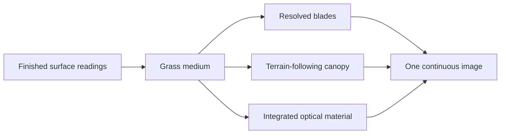

# RFC-0006: A continuous grass medium

Status: proposed; Gate 3 and Gate 4 proofs implemented, acceptance still open

## Decision

Moppe will treat grass as one terrain-bound plant medium with several
continuous evaluations, not as unrelated blade geometry and green terrain.
Distance may change how the medium is sampled, but it must not change what is
growing, where it is rooted, how much leaf area it contains, or the vertical
space that leaf area occupies.

The intended evaluations are:

1. resolved blades near the camera;
2. a terrain-following canopy evaluation in the middle field; and
3. an integrated optical material in the far field.

These are not three authored kinds of grass. They consume one habitat, one
world-anchored population, and one vertical density profile. Their weights
form a partition of that medium, so representation can move continuously
between them without inventing or losing grass.

This is a specific grass design, not the beginning of a generic material
framework. Grass is unusually suited to it because it is rooted in and follows
the terrain. A later material may reuse a proven idea, but this work will not
abstract ahead of an actual second use.

## The invariant: distance changes representation, not the world

The forest LOD established the useful principle: removing geometric detail
must not make a tree lose foliage. Grass needs the same discipline, but its
small scale makes the crossover faster and its terrain attachment gives it a
different aggregate form.

For grass, conservation has five parts.

### Leaf-area conservation

The population measure is leaf area over a patch of ground. The sum realized
as blades, canopy, and aggregate material must equal the leaf area requested by
the habitat. Retiring blades do not disappear and the remaining blades do not
grow into implausibly broad ribbons to compensate.

### Projected optical conservation

Equal leaf area does not guarantee equal appearance. The evaluations must also
agree about the view ray's optical depth: how much light is intercepted,
reflected, transmitted through thin leaves, or absorbed within the stand.
Coverage should approach a Beer--Lambert-like bounded response rather than a
collection of independent green additions. A change of view or sun may change
the grass, but it must do so for an optical reason and continuously across the
representation boundary.

### Vertical-profile conservation

Grass is not located on the mathematical terrain surface. Its medium has a
basal stratum near the soil, an upper distribution of leaves, and a canopy
height. Replacing tall blades with albedo painted at ground height conserves
neither parallax nor horizon occlusion. Every evaluation must represent the
same vertical profile to the degree its projected footprint can resolve.

### Spatial conservation

Roots, clumps, height variation, wind phase, and habitat boundaries are
world-anchored. Camera motion may reveal a patch but must never move, reshuffle,
or grow it. Transition weights come from projected footprint and may vary with
the view; the underlying population never does.

### Habitat conservation

The medium decides once whether grass can root. Explicit blades and aggregate
shading must not ask different versions of that question. Rootability is a
semantic property of the finished surface -- soil or mobile sediment,
moisture, slope stability, erosion exposure, deposition, snow, altitude,
water, and intentional wear -- not a test of whichever color texture the
terrain renderer selected.

## Current situation

Commit `42ed47b` made the first structural entry into this design. The
2026-08-11 continuation now supplies bounded Gate 3 and Gate 4 proofs without
claiming the whole RFC complete.

- `moppe/shaders/metal/grass_medium.h` now owns shared habitat, leaf area,
  cover, clumping, blade tint, projected-width partitioning, wind, and several
  optical functions.
- The undergrowth mesh shader uses a denser 0.60 m root lattice and keeps
  surviving grass at a physical blade width. The old distant widening into
  shrub-like clumps is gone.
- The terrain shader keeps a distinct leaf-area-derived basal cover at every
  distance; projected blade width controls only the explicit upper leaves.
- World-lattice identities remain stable while counts cross their projected
  thresholds, and fine blade flutter and glint retire before the blades that
  carry them become unrepeatable samples.
- Grass laboratory stills and a moving ride show a much denser near field and
  remove the former bright hedge around the camera.
- `sward_canopy_*` uses a conservative terrain-following top envelope to enter
  the middle field. Its fragment shader integrates a world-anchored density
  column toward the ground, with a finite grazing path and four deterministic
  vertical samples. The mesh patches merely bound dispatch; they do not stand
  for tufts or individual plants.
- Resolved blades, the middle density column, and the far terrain material now
  partition one leaf-area population. Retiring blades retain physical width;
  their tint, directional light, transmission, and glint converge in place to
  the same ensemble moments instead of running a second fragment material.
- `moppe_sward_optical_response` supplies one Beer--Lambert coverage and
  bounded reflection, thin-leaf transmission, and broad sheen response to the
  unresolved evaluations. The four symmetric leaf-normal lobes are evaluated
  as one compact moment, not sampled stochastically.
- The shipped grass photograph is decoded by hardware as sRGB. Its aggregate
  detail is normalized against its measured linear mean (`0.0902`), not the
  display-space value `0.40`; the earlier mismatch was the main cause of the
  dark far register.
- The earlier camera-relative displacement of terrain vertices is removed.
  The canopy is presentation geometry above the true terrain and does not
  alter terrain, physics, or world state.
- Projected-size gates now use row norms of the unjittered world-to-clip
  matrix, making the result invariant under camera pitch and yaw.

That implementation establishes the representation and optical contract, but
it is not yet the full ecological or traversal acceptance described above.

### Known failures

1. **Rootability is missing.** Grass habitat knows moisture, canopy, wear,
   slope, snow, altitude, and standing water, but not whether the ground is
   soil, alluvium, scree, or exposed bedrock. Its slope and altitude bands
   currently overlap the terrain's cliff and scree bands, so blades grow from
   visibly stony highlands.
2. **Basal cover is distinct but still shallow.** It is now a denser
   Beer--Lambert consequence of the same leaf claim rather than the upper
   cover scalar, but visually it remains a dark turf-and-litter material. It
   does not yet represent short tillers, dead leaves, or deep litter shadow.
3. **The middle-scale volume remains a proof.** It restores a finite vertical
   path and parallax without inventing coarse plants, but its four-sample
   profile and correlation length still need acceptance in longer ground and
   aerial motion. Consecutive glide and ride frames are useful evidence, not a
   substitute for walking, jumping, riding, and gliding the actual game.
4. **The optical response is bounded, not calibrated ground truth.** Leaf
   normals, extinction, transmission, and sheen now share one budget, but the
   coefficients are matched structurally rather than fitted from a measured
   blade ensemble. The visual first moment is good enough for a proof; its
   angular response still needs rotation tests over real sloped habitats.
5. **The forest is not solved by the grass proof.** Dark forest interiors and
   distant stands still expose a separate absence of stand-scale canopy and
   understorey aggregation. Reusing the grass code as a generic vegetation
   framework would conceal that different quotient rather than solve it.

The beautiful forest-floor case is genuine evidence, not a contradiction.
Side-on overlap, backlighting, and dark forest context are exactly the
conditions the current resolved-blade evaluator handles well. Aerial and
down-slope views expose the information it does not yet hand to the aggregate.

## Proposed medium

The shared grass state should grow from its current fields toward this
semantic content:

- `rootability`: whether this surface can sustain the plant medium;
- `basal_cover`: short turf, tillers, litter, and shadow immediately above the
  soil;
- `leaf_area`: the conserved upper-leaf population;
- `canopy_height`: the vertical extent of that population;
- `orientation`: a mean direction and spread, rooted in the local surface but
  biased by gravity, light, and wind;
- moisture, tint, clump identity, and riparian response; and
- the resolved, canopy, and aggregate weights for the current projected
  footprint.

Not every value must become a stored texture. Values that are pure functions
of shared readings may remain shader functions. Rootability should become a
finished-surface reading if deriving it independently in two shaders would
reintroduce disagreement.

## Execution sequence

### Gate 1: one rootability and one claim

Derive a continuous rootability reading from the surface's actual sediment
thickness and erosion/deposition history together with slope stability. Exposed
bedrock and unstable scree reject grass; stable soil and deposited alluvium
admit it; shore sediment may support a sparse riparian response without making
all sand grassy.

Feed that reading to both terrain and undergrowth evaluation. Delete the later
terrain-only habitat reconstruction. Albedo, floor shadow, blade count, and
canopy lighting all use the same final grass claim.

Acceptance: the same stony highland and mottled slope remain grass-free from
every camera direction and distance, while genuine forest soil, meadow, and
riparian sites retain continuous cover.

### Gate 2: give the medium a floor

Add basal cover as an all-distance component of the medium. Near the camera it
should read as short turf and brown-green thatch with strong self-shadow,
without requiring another population of individually modelled blades. It must
yield naturally to trails, exposed rock, standing water, and snow through the
same rootability and habitat decision.

Acceptance: looking down through tall forest grass reveals a dark, coherent
plant floor rather than bright gravel, without turning paths into green paint.

### Gate 3: prove the terrain-following canopy

Build one bounded Metal atelier inside the current grass path: a shallow shell
or comparably small mesoscale surface derived from terrain height and the
medium's canopy height. It carries world-anchored height variation,
orientation, stochastic coverage, and enough depth or parallax to preserve the
field's thickness. It owns only the leaf-area fraction between resolved blades
and the fully integrated material.

The proof may use one shell or a very small fixed number. It must not displace
the authoritative ground, affect physics, become retained plant geometry, or
introduce a render-graph or material framework.

Acceptance: in a low flight or downhill overview, no camera-centred circle
separates upright grass from flat green terrain, and field boundaries retain a
small but convincing height and occlusion profile.

### Gate 4: integrate one bounded optical response

Replace the far material's independent lighting corrections with one aggregate
response driven by leaf area, orientation distribution, view direction, sun
direction, and projected path length through the canopy. It should account for
diffuse reflection, thin-leaf transmission, broad anisotropic sheen, and
opposition without allowing their sum to create unbounded green light.

The canopy shell and the far material use the same response at different
spatial resolutions. Fine wind disappears with its carrier; broad gust phase
persists.

Acceptance: rotating around a fixed hillside changes brightness and sheen
continuously, never changes whether the hillside is grass, and does not reveal
the evaluator boundary.

### Gate 5: calibrate the whole profile in motion

Tune density, basal cover, height, transition footprints, and cost together.
Do not extend blade reach merely to move a ring outward. The grass laboratory
isolates the representation gradient; ordinary gazetteer sites verify habitat;
a moving ride and a low aerial pass verify temporal stability.

Acceptance evidence includes:

- grass-laboratory sunward, crosslit, antisun, and downward views;
- frozen stony-highland, eroded-slope, forest-floor, meadow, trail, and
  wetland views;
- consecutive-frame rides through open and forested grass;
- a low aerial or glider pass over a field boundary; and
- a before/after GPU measurement of the scene pass on the ordinary M2 Pro
  configuration.

## Constraints and non-goals

- No generic material framework, vegetation manager, or scene graph.
- No distance-authored habitat and no camera-centred procedural identity.
- No widening a surviving blade to carry an entire retired clump.
- No opaque promise that normal mapping alone supplies canopy volume.
- No displacement of the authoritative terrain surface merely to make grass
  look thick.
- No still-frame claim of temporal stability; motion is part of acceptance.
- Metal is the first complete proof. WebGPU may retain a simpler aggregate,
  but the backend difference must be explicit rather than an accidental
  disagreement about where grass exists.

## Completion

This RFC is complete when a single finished-surface habitat produces all grass
evaluations; leaf area, optical depth, and vertical profile cross their
representation boundaries without a visible ring; stony and unstable ground
remain bare; dense stands have a convincing basal floor; and both a ride and a
low aerial pass show no popping, crawling, or angle-dependent material glitch.

If accepted, the work should become a short track following the five gates
above. Until then, this RFC records the intended invariant and the current
failure honestly; it claims a concrete representation proof, not complete
ecological or traversal acceptance.
