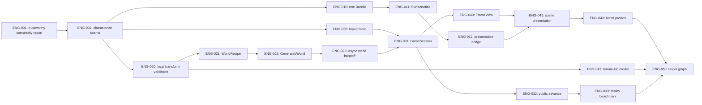

# Current-engine refactoring

This is the executable track for [RFC-0001](../../rfcs/0001-current-engine-refactoring.md).
It is a dependency graph, not a release calendar. Work can happen in parallel
when nodes are independent, but an item becomes `ready` only when its declared
dependencies are `done`.

The first item intentionally repairs the complexity instrument. The earlier
report showed real cyclomatic concentration, but unity builds currently make
its cognitive column and scan scope unreliable. We should not steer a large
refactor with a crooked compass.

Run `make plan-graph` to render this exact graph from the work-item metadata.
The checked-in view above is a compact map for browsing; the item files are
authoritative.
