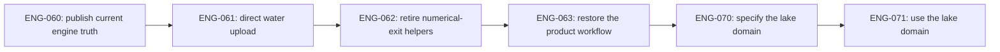

# Engine consolidation

This is the executable track for
[RFC-0002](../../rfcs/0002-engine-consolidation-and-world-relations.md).
It closes the successful but partially documented terrain harmonization,
harvests the narrow useful result of the workshops, and establishes lake
identity as the first production graph domain.

The sequence is intentionally narrow. It does not reopen the completed
RFC-0001 ownership work, and it does not make the workshop implementations
dependencies of the game.
