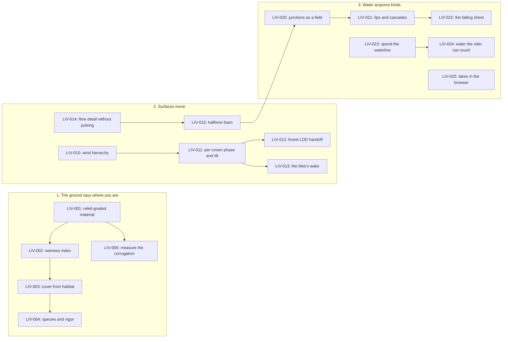

# Living world

This is the executable track for
[RFC-0003](../../rfcs/0003-a-world-that-reads-as-alive.md). It spends the
fields the generator already computes: first on what the ground says, then on
how surfaces move, then on giving water kinds.

Movement 1 is the readout the world was already owed. Movement 2 is the
cheapest aliveness in the whole library — most of its items are a day. Movement
3 closes the water TODOs the archived notebook has carried since July, and its
first item is expected to make rivers *cheaper*, not dearer.

Movement 4 — the merge tree as the one hydrological structure, storms as a
display of the drainage graph, and a wear field the ground keeps — is named in
the RFC and deliberately not decomposed here. It becomes its own RFC once
movement 3 has proven the field-first rendering discipline.
