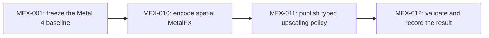

# Pixel reconstruction

This is the first executable track for
[RFC-0004](../../rfcs/0004-reconstruct-expensive-pixels-on-metal-4.md). It
accepts only the smallest independently useful branch: preserve the landed
Metal 4 renderer, freeze its baseline, and replace linear enlargement with a
measured spatial MetalFX path on supported devices.

Temporal reconstruction, denoising, and ray-traced water remain later RFC
branches. This track must finish with a useful fallback even if spatial
MetalFX fails its quality or performance gate.

The track is complete. Spatial MetalFX cleared the matched visual and GPU
gate, ships as the default request on supported macOS and iOS Metal 4 devices,
and retains linear enlargement as an explicit comparison and fallback. See the
[findings](findings.md) for the baseline, hashes, performance result, platform
build matrix, and scoped verdict.
