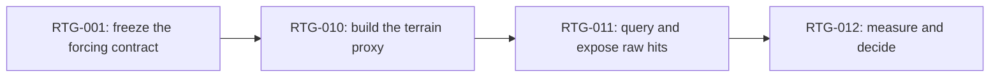

# Reflection geometry

This is Goal 0 beneath Gate 3 of
[RFC-0004](../../rfcs/0004-reconstruct-expensive-pixels-on-metal-4.md). It
proves only the representation that a future water-reflection pass would
need: a bounded terrain proxy derived from the authoritative completed
surface, one retained acceleration structure, and inspectable primary-ray hit
truth at the deterministic lake forcing view.

It deliberately does not trace water reflection rays, shade hits, composite
water, accumulate history, denoise, or interpolate frames. Those steps remain
separate decisions because a working acceleration structure does not by
itself prove that ray-traced water is worth shipping.

The track is complete. The representation and traversal proof works, remains
isolated behind `MOPPE_REFLECTION_GEOMETRY`, and is worth keeping as an
atelier foundation for one reflected-ray experiment. See the
[findings](findings.md) for the proxy error, memory, build-time distribution,
hardware boundary, validation matrix, and scoped verdict.
