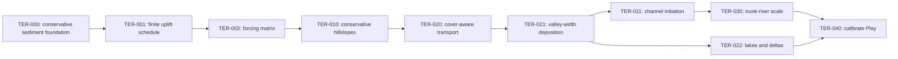

# Terrain landforms

This is the executable track for
[RFC-0005](../../rfcs/0005-depositional-landforms.md). It begins with the
conservative sediment foundation already landed, separates uplift from
relaxation, then builds hillslope, channel, floodplain, and lake geography in
that dependency order.

## Program, not queue

The track keeps the long argument visible while individual commits stay
small. Its gates are causal:

- forcing is chosen before a hillslope law is tuned against it;
- a conservative hillslope regime exists before transport is coupled to
  mobile cover;
- mobile-cover feedback and valley-floor deposition exist before channel
  heads suppress the incision that currently drains small basins;
- valley floors exist before river width is judged; and
- the default profile changes only after the whole seed suite passes.

The fixed reference is seed 123 at the ordinary Play extent and resolution.
The accepted seed suite later includes varied coast, lake, relief, and trail
conditions. Captures use an optimized build; an unoptimized 2048-square
generation is not performance evidence.

## Current findings

`c3ae995` closes the fluvial solid-volume ledger and proves stable caching.
Its rate-limited deposition removes impossible one-cell towers. The resulting
two-million-year world is coherent but still nearly all alpine, with narrow
valleys and little rolling land.

TER-001 separates the clocks: seed 123 with 500 ky of uplift followed by
1.5 My of unforced relaxation produces broad forested ridges, connected
rolling country, and materially lower relief in the actual renderer. Fine
fluting remains. TER-002 compared 250, 500, and 750 ky and selected 500 ky:
250 ky loses convincing mountain groups, while 750 ky reaches 407 m of relief
and leaves only 4.4% of land below ten degrees. The full finding is recorded
in [`findings.md`](findings.md). TER-010 now addresses the remaining fluting
with conservative hillslope transport. TER-010 preserves that shape while
making every creep transfer part of the solid ledger. The first TER-011 matrix
then exposed a dependency error: physically meaningful channel-head scales
produce perched basins and sheer channel walls before cover feedback and
valley-floor deposition exist. The typed experiment and evidence remain, but
TER-020 and TER-021 now precede the final channel-scale selection.

TER-020 now closes that first dependency. Incoming load consumes a typed
discharge-based capacity, mobile cover is re-entrained before bedrock is cut,
and a four-candidate optimized matrix selects 0.00002 as the Play
concentration. Lower capacity preserves the knife-edge terrain under a cover
blanket; twice the selected capacity collapses most upland relief. The
selected world shows rivers and local depositional plains while retaining
mountain groups. That calibration supplied the centerline volume carried into
TER-021's physical valley-width footprints.

TER-021 now performs that conservative lateral placement. A meter-scaled,
downstream-widening footprint equalizes its lowest receiving cells and stops
at local valley walls. At seed 123 it triples the largest connected gentle
region with almost no loss of total relief and no material generation-time
regression. The cover and valley dependencies are therefore closed; TER-011
is ready to revisit physical channel initiation against the improved process
model.

## Deferred until the shape works

Grain classes, porosity, compaction, stratigraphy, and detailed suspended-load
physics remain outside this track. They may refine a successful geography;
they are not allowed to substitute for one.
